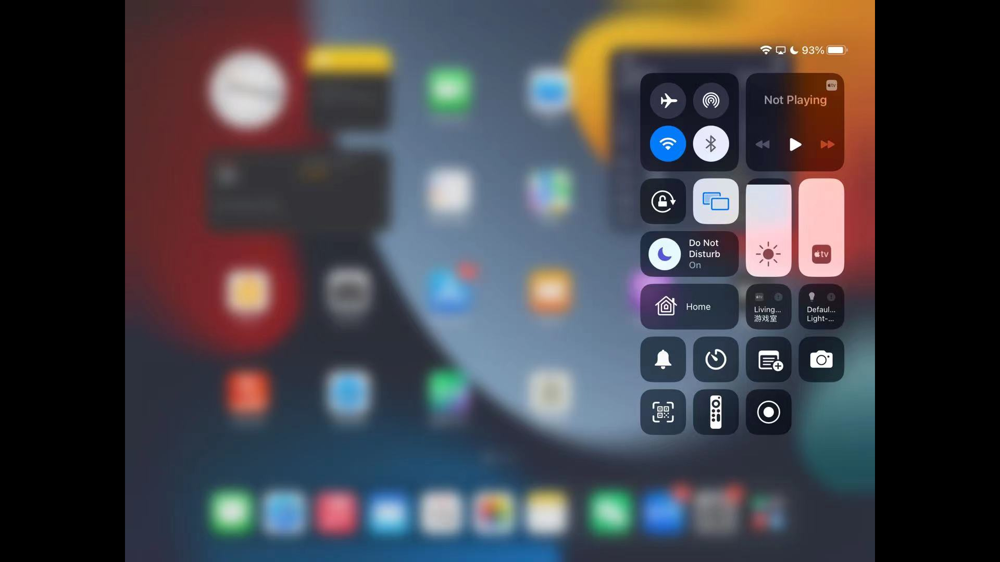

# 🔵 AirReceiver

AirReceiver là bộ thu AirPlay, Cast, Wireless Display và DLNA. Với AirReceiver, bạn có thể truyền trực tuyến màn hình, ảnh, nhạc, video từ điện thoại, laptop lên TV. Nó hoạt động ở chế độ nền, truyền phương tiện đến thiết bị Android của bạn, Nó đặc biệt phù hợp với Android TV/Box.

.png>)

Tính năng:

* hỗ trợ video Youtube.
* hỗ trợ đồng bộ âm thanh với các thiết bị AirExpress khác.
* hỗ trợ AirMirror. hiệu suất tốt nhất trong ứng dụng AirPlay của bên thứ ba.
* Hỗ trợ đầy đủ IOS10.
* hỗ trợ tính năng trình chiếu.
* Khả năng tương thích với AirParrot. bạn có thể sử dụng AirParrot phản chiếu màn hình PC trên Máy tính bảng Android.
* phát trực tuyến âm thanh/video/hình ảnh từ các ứng dụng AirPlay (itunes, iOS, ...)
* phát trực tuyến âm thanh/video/hình ảnh từ các máy khách DLNA (WMP12, AirShare, ...)
* chạy nền như một dịch vụ
* tên mạng có thể định cấu hình
* có thể được khởi động khi khởi động
* Windows Screen Mirror: Tải xuống và cài đặt AirSender Công cụ Miễn phí trong PC của bạn (http://www.remotetogo.com). Nhấp vào biểu tượng "AirSender" trên thanh trạng thái Windows, chọn Thiết bị chạy AirReceiver. Tính năng mới: Version: 4.9.6 Mod by TryRoom Fix compability issue with Android 11. Bug fix and stability improve.

## Download


